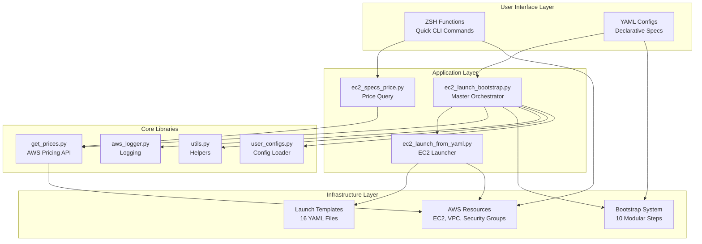
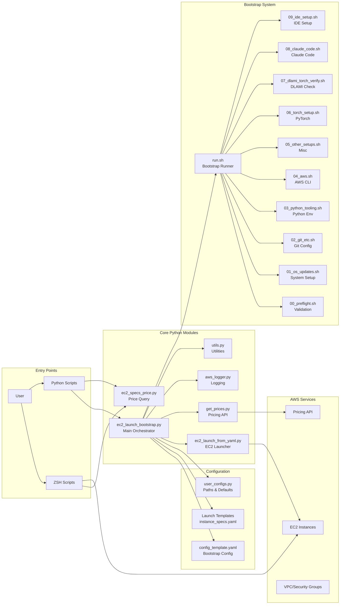
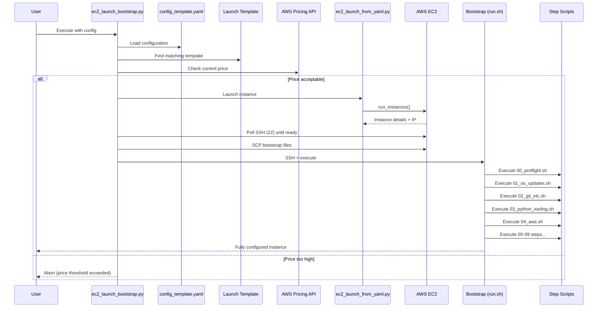
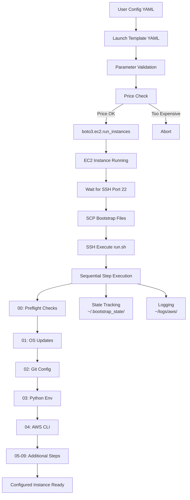
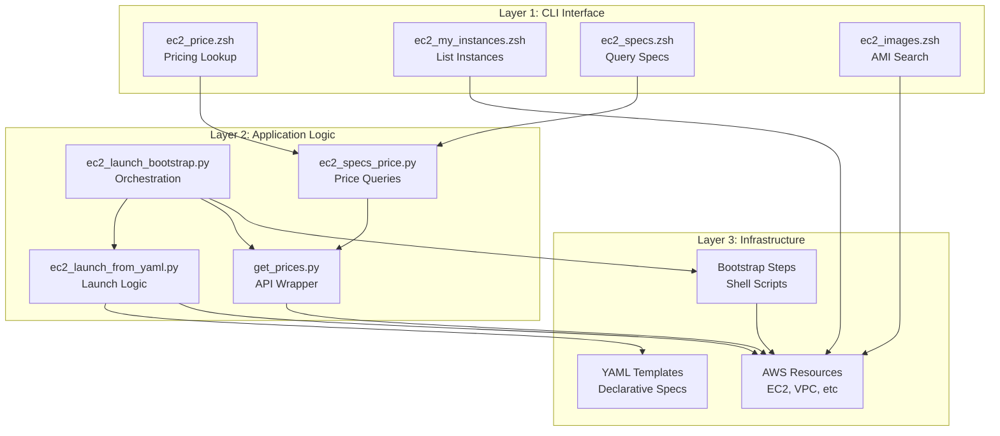
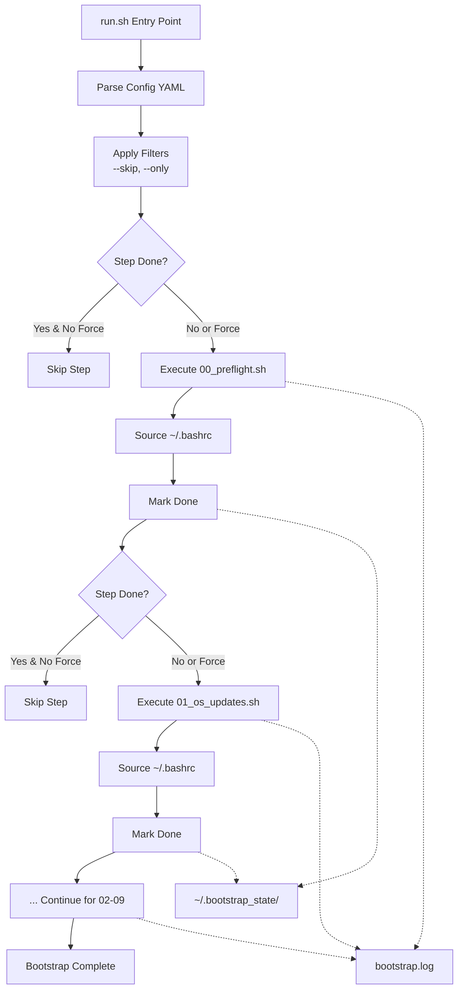

# AWS-Utils Architecture

## Project Overview (created with claude-code)

**aws-utils** is a personal automation utility for streamlining the complete lifecycle of AWS EC2 instance management, from launch to fully-configured development environment in under 5 minutes.

## High-Level Architecture



## Detailed Component Architecture



## Launch + Bootstrap Workflow



## Data Flow Architecture



## Three-Layer Architecture



## Bootstrap System Architecture



## Key Architectural Patterns

### 1. Declarative Configuration
- All instance specifications in YAML (not hardcoded)
- Bootstrap steps and requirements in config_template.yaml
- Enables templating, versioning, and reusability

### 2. Modular Bootstrap Design
- Independent shell scripts with numeric prefixes (00-09)
- Each step can be executed, skipped, or forced independently
- Dry-run mode for safety
- State files prevent accidental re-execution

### 3. Separation of Concerns
- **aws_logger.py**: Centralized logging
- **get_prices.py**: Dedicated pricing API wrapper
- **utils.py**: Reusable utilities
- **user_configs.py**: Single source of truth for paths

### 4. Defensive Programming
- Duplicate instance detection before launch
- Price validation before instance creation
- SSH readiness polling with timeout
- Comprehensive pre-flight checks
- Fallback values in pricing lookups

### 5. Type Safety
- Python 3.12+ with strict mypy configuration
- Ruff linting with modern Python rules
- Proper type hints in core functions

## Directory Structure

```
aws-utils/
├── bootstrap/              # Bootstrap system
│   ├── run.sh             # Master orchestrator
│   ├── steps/             # 10 modular setup scripts (00-09)
│   └── config_template.yaml
├── configs/               # Configuration
│   ├── user_configs.py    # Central config loader
│   └── regions.yaml       # AWS region mappings
├── docs/                  # Documentation
│   ├── step_0_overview_setup.md
│   ├── step_1_launch_manage_ec2.md
│   ├── step_2_instance_setup.md
│   └── step_3_one_shot_launch_bootstrap.md
├── launch/                # 16 YAML launch templates
│   ├── t/                 # t-family instances
│   ├── c/                 # c-family instances
│   ├── g/                 # g-family instances
│   └── ...
├── scripts/               # Core Python scripts
│   ├── ec2_launch_bootstrap.py
│   ├── ec2_launch_from_yaml.py
│   └── ec2_specs_price.py
├── src/                   # Source libraries
│   ├── get_prices.py
│   ├── aws_logger.py
│   └── utils.py
├── zsh_general_info/      # General info queries
│   ├── ec2_price.zsh
│   ├── ec2_specs.zsh
│   └── ...
└── zsh_my_instances/      # Instance management
    ├── ec2_my_instances.zsh
    └── ...
```

## Component Responsibilities

| Component | Responsibility |
|-----------|---------------|
| **ec2_launch_bootstrap.py** | Orchestrates full launch + bootstrap workflow |
| **ec2_launch_from_yaml.py** | Parses YAML and launches EC2 via boto3 |
| **ec2_specs_price.py** | CLI tool for querying instance pricing |
| **get_prices.py** | Wraps AWS Pricing API with error handling |
| **aws_logger.py** | Tracks AWS operations with timestamps and metadata |
| **run.sh** | Sequences bootstrap steps with state tracking |
| **00_preflight.sh** | Validates OS, architecture, disk, network |
| **01-09 steps** | Modular system configuration tasks |
| **config_template.yaml** | Defines bootstrap inputs and requirements |
| **Launch templates** | Pre-configured instance specifications |
| **ZSH functions** | Quick CLI access to AWS operations |

## Design Philosophy

1. **Minimize Friction**: Complete setup from bare instance to dev-ready in <5 minutes
2. **Treat as Ephemeral**: Launch/teardown on-demand to minimize idle costs
3. **Declarative Over Imperative**: YAML configs over hardcoded parameters
4. **Modular & Extensible**: Easy to add new bootstrap steps or templates
5. **Defensive & Safe**: Validation, dry-runs, state tracking, error handling
6. **Type-Safe & Modern**: Python 3.12+, mypy, ruff, proper error handling
